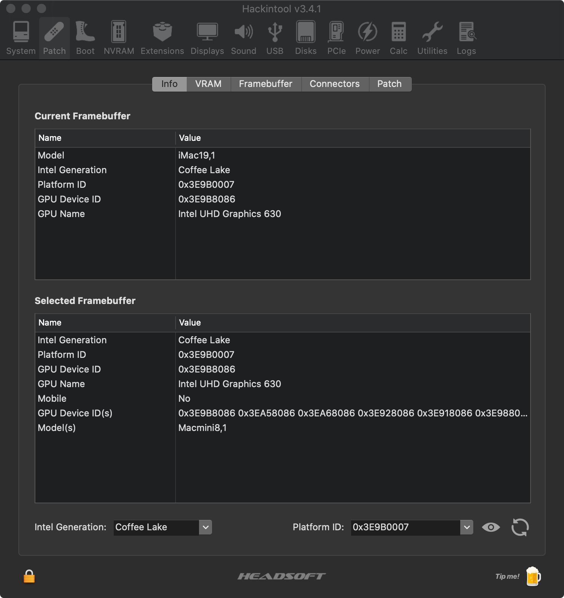

## **Guidence**
***
```This guidence will tell you how to make a perfective hackintosh device```
## **Contents**
* [Before Start](#BeforeStart)
* [References](#References)
* [Choose Device](#Choose-Device)
  * [Desktop PC](#Desktop-PC)
    * [CPU](#CPU)
    * [GPU](#GPU)
    * [Motherboard](#Motherboard)
    * [Stroage](#Storage)
    * [Memory](#Memory)
    * [WLAN Card & Bluetooth](#WLAN-Card(&Bluetooth))
    * [Barebone Computer](#BareboneComputer)
  * [Laptop](#Laptop)
    * [CPU](#Mobile-CPU)
    * [GPU](#Mobile-GPU)
    * [Motherboard](#Mobile-Motherboard)
    * [Mobile Storage](#Mobile-Storage)
    * [Laptop Memory](#Laptop-Memory)
    * [Laptop WLAN Card & Bluetooth](#Laptop-WLAN-Card(&Bluetooth))
* [BIOS Settings](#BIOS-Settings)
  * [Enable](#Enable)
  * [Disable](#Disable)
* [Disk Partition](#Disk-Partition)
  * [Create ESP(EFI) volume](#Create-ESP(EFI)-volume)
  * [Volume partition](#Volume-partition)
* [Windows Installation](#Windows-Installation)
* [MacOS Installation](#MacOS-Installation)
  * [MacOS Diskpartition](#MacOS-Disk-Partition)
    * [Boot Tool](#Boot-Tool)
  * [Installation-Step](#Installation-Step)
    * [Before-Loading](#Before-loading)
    * [While-Loading](#While-loading)
    * [While-Installing](#While-installing)
    * [After-Installation](#After-installation)
* [Patch](#Patch)
  * [Graphic Card](#Graphic-card)
    * [iGPU](#iGPU)
      * [iGPU Patch](#iGPU-patch)
    * [PEG](#PEG)
      * [Configuration in config.plist](#Configuration-in-'config.plist')
      * [Display Output Repair](#Display-Output-Repair)
  * [Audio](#Audio)
  * [USB](#USB-Port)
    * [Open USB Port Limited](#Open_USB_port_limits)
      * [Configure USB Port](#Configuration-USB-port-in-'config.plist')
    * [Custom Active USB Port](#Custom_Active_USB_Ports)
  * [CPU](#CPU)
    * [CPU SSDT](#CPU_SSDT)
  * [Other Feature](#Other-Feature)
    * [Custom ID](#Inject_SmUUID_ROM_CustomUUID)
    * [iMessages and Facetime](#iMessage-and-Facetime)
* [DSDT & SSDT](#DSDT-and-SSDT)
  * [DSDT](#DSDT)
    * [Repair Sleep](#Repair-Sleep)
  * [SSDT](#SSDT)
    * [Repair Brightness on Laptop](#Repair-brightness-on-laptops)


## **BeforeStart**
```diff
!   1. Be Patient
!   2. Studious and come up with a solution via all ways you can find(Search Engine,BBS,YouTube etc.)
- When you lose a patient:
+   1.Buy a Mac
+   2.Go to reddit and pay some money
```
## References
* ```tutorial```
  1. [**tonymacx86**](https://www.tonymacx86.com/)
  2. [**reddit**](https://www.reddit.com/r/hackintosh/)
  3. [**youtube**](https://www.youtube.com)
* ```Hackintosh Step```
---
  * 
---
## **Choose-Device**
```A good device choice is half the battle```
### __Desktop-PC__
#### CPU
```diff
Recommand
+    1.Intel 9th generation Core i3/i5/i7/i9 series(Coffee Lake)
+    2.Intel 8th generation Core i3/i5/i7 series(Coffee Lake)
+    3.Intel 4th generation Core i3/i5/i7 series & Intel Xeon E3-12XXV3 series(Hasewell)
+    4.Intel 3rd generation Core i3/i5/i7 series & Intel Xeon E3-12XXV2 series(Ivy Bridge)
Can Support
!   1.Intel Pentium G Series(such as G2030 G3260)
!   2.Intel Core E series(such as E8400 E5800) & Intel Core Q series(such as Q9600)
!   3.Intel Celeron G Series(such as G1840)
!   4.Intel 10th generation Core i3/i5/i7/i9 series(Comet Lake)(only support OC boot)
!   5.AMD Ryzen 1st/2nd/3rd series
!   6.AMD A Series APU(such as A10-7800 A10-9600)
Don't
-   1.Intel Atom Series(such as D525 N330)
-   2.AMD Ryzen APU(such as 2200G 3400G)
-   3.Intel Celeron J Series(such as J1900) & N Series(such as N4100)
#   CPU which not mentioned above please search by yourself
```
#### GPU
  1. Brand
     ```diff
     Recommand
     +  1.Sapphire
     +  2.Dataland
     +  3.Asus
     Can Support
     !  1.AsRock
     Don't
     -  1.XFX
     -  2.Reference
     ```
  2. Model
     ```diff
     Recommand
     +  1.Radeon RX5500XT/RX5600XT/RX5700
     +  2.Radeon RX560XT/RX590
     +  3.Nvidia GPU Card with Kepler architect(such as GTX760 GTX690)
     +  4.Intel HD/UHD series desktop GPU(integrated,exclude 10th generation)
     Can Support
     !  1.Nvidia GPU Card with Maxwell architect(such as GTX970 GTX1060)(need WebDrive and OS version up to 10.13.6)
     !  2.Radeon RX5700XT(may need black screen patch)
     !  3.Radeon RX460/RX470/RX480/RX560/RX570/RX580(2304SP)(miner card)
     Don't
     -  1.Radeon RX580 2048SP(device-id isn't 1002-67DF)
     -  2.Nvidia GTX16 series and RTX20 series
     #  GPU which not mentioned above please search by yourself
     ```
#### Motherboard
  1. Brand
     ```diff
     Recommand
     +  1.Gigabyte
     +  2.Asus
     +  3.AsRock
     +  4.MSI
     Can Support
     !  1.Onda
     !  2.Colorful
     Don't
     -  1.Soyo
     -  2.OEM
     ```
  2. Chipset
     ```diff
     Recommand
     +  1.Z390 Chipset
     +  2.Z370 Chipset
     +  3.B85 Chipset
     Can support
     !  1.B360 Chipset
     !  2.H310 Chipset
     !  3.B75 Chipset
     !  4.B450 Chipset
     !  5.H310 Chipset
     Don't
     -  Old Chipset(such as Intel 965 AMD A55)
     #  Chipset which not mentioned above please search by yourself
     ```
#### Storage
```diff
Recommand
+   1.Samsung 970 EVO(NVME)
+   2.Western Data SN730(NVME)
+   3.KIOXIA RC10(NVME)
+   4.Micron MX500(SATA)
+   5.Samsung 860 EVO(SATA)
+   6.KIOXIA TC10(SATA)
Don't
-   1.Samsung 970 EVO Plus(NVME)
-   2.Samsung PM981/PM981A(NVME)
-   3.Intel Optane Series(NVME)
-   4.Intel 660P QLC(NVME)
```
#### Memory
```diff
Recommand
+   1.KingSton
+   2.Micron
+   3.KLEVV
Don't
-   1.Samsung
-   2.Corsair
-   3.non-brand(such as Cuso)
```
#### WLAN-Card(&Bluetooth)
```diff
Recommand
+   1.Boardcom 943602CS (2.4G/450Mbps 5G/1300Mbps Bluetooth 4.2)
+   2.Boardcom 94360CD  (Fenvi T919) (2.4G/450Mbps 5G/1300Mbps Bluetooth 4.0)
+   3.Boardcom 94360CS2 (2.4G/450Mbps 5G/867Mbps Bluetooth 4.0)
Can Support
!   1.Boardcom 94350ZAE (DW1820A)(2.4G/300Mbps 5G/867Mbps Bluetooth 4.1)
Don't
-   1.Intel AX series(such as AX200)
-   2.Intel AC series(such as 9260ac 3160ac)
#  WLAN Card which not mentioned above please search by yourself
```
#### BareboneComputer
```diff
+   1.Intel NUC8 Series
+   2.AsRock Deskmini310 Series
```
### __Laptop__
  * [LTS Laptop List](https://blog.daliansky.net/Hackintosh-long-term-maintenance-model-checklist.html)
#### Mobile-CPU
```diff
+   Intel Core i3/i5/i7 mobile series
-   Intel Atom mobile series(such as N270)
-   AMD Ryzen 4 series mobile CPU(such as 4600U)
#   CPU which not mentioned above please search by yourself
```
#### Mobile-GPU
```diff
-   Nearly all AMD or Nvidia mobile GPU are not supported
-   Intel 10th generation(Ice Lake) mobile GPU haven't supported yet
+   Intel GMA/HD/UHD series mobile GPU(integrated)
+   Nvidia Geforce GT320m(individual)
+   Nvidia Geforce 9400m(individual)
#   GPU which not mentioned above please search by yourself
```
#### Mobile-Motherboard
* ``` Depends on your CPU ```
#### Mobile-Storage
* [Desktop PC Storage)](#Storage)
#### Laptop-Memory
```diff
-   some LPDDR4X model memorys may cause crash
```
#### Laptop-WLAN-Card(&Bluetooth)
* [Desktop PC WLAN-Card(&Bluetooth)](#WLAN-Card(&Bluetooth))
## BIOS-Settings
### Enable
```diff
!   some motherboard may not contain these options,if your installation are normal,you can ignore that,or you need patch them 
+   1.VT-x
+   2.Exective Disable bit
+   3.iGPU(only use iGPU or multi-monitor) / IGFX
+   4.Above 4G decoding
+   5.XHCI-Handoff
```
### Disable
```diff
-   1.Fast Boot
-   2.CSM
-   3.CFG Lock
-   4.Secure-Boot
-   5.VT-d
-   6.Boot Option -- OS Type -- Other
-   7.Onboard Wi-Fi and Bluetooth
```
## **Disk-Partition**
```diff
!   We assume that you have a new computer.
!   If you already have a computer with windows operating system,PLEASE BACKUP YOUR DATA
```
### __Create-ESP(EFI)-volume__
```diff
!     Usually,windows operating system disturbute about 120MB for ESP(EFI) volume
      1.Download 'DaBaiCai Installation Tool'
```
*   [DaBaiCai Installation Tool](https://pan.baidu.com/s/1HTCgWwzTIrK9V_VYv7olWw)  
    **Code: 0iob**
```
      2.Open it and download all components,press OK(确定)
      3.Wait for download(may take 5 minutes)
```

```diff
!     Before the next step,YOU MUST BACKUP YOUR DATA
      4.connect your USB flash disk,and press 'One-Key-Make-USB-Boot-Device'(一键制作成USB启动盘)
      5.Wait for making
      6.Reboot and enter WinPE system
      7.Open 'Diskgenius.exe'
      8.Choose the disk you want to install MacOS and Windows
```

```
      9.Partition(分区) --- create ESP(EFI)/MSR partition(建立ESP/MSR分区)
```

```diff
!     You can change the size from 350MB to 500MB as you like
      10.Change ESP(EFI) volume size
```

```
      11.Press 'OK'
```
### __Volume-partition__
```diff
+     You can partition your disk into 3 volumes(assume your disk size is 500GB,465GB avaliable)
+     Windows:  2 volumes  (C(120GB) and  D(144GB))
+     MacOS:  1 volume(MacOS(200GB))
```
* ```Windows Partition``` 
```
      1.Partition(分区) --- create new partition(创建新分区)
```

```diff
      2.File system(文件系统类型) --- NTFS
      3.Input the size you want
      4.Press 'Ok'(确定)
      5.Press F8(Save partition table)(保存分区表)
      6.Partition --- format current partition(格式化当前分区)
+     Recommand cluster size is 4096 bytes
      7.Press 'Format'*(格式化)
```
  
* ```MacOS partition```
```diff
-     Don't format volume
+     Use MacOS --- 'Disk Tool' instead
```
## __Windows-Installation__
```diff
!     You need another available PC to write image
-     Don't use DaBaiCai Tool(大白菜) install Windows
```
  * ```Download Windows image```  
      * [Windows 10 Consumer X64] (ed2k://|file|cn_windows_10_consumer_editions_version_1909_updated_jan_2020_x64_dvd_47161f17.iso|5417457664|274FEBA5BF0C874C291674182FA9C851|/)(```memory size above 4GB```)
      * [Windows 10 Consumer X86] (ed2k://|file|cn_windows_10_consumer_editions_version_1909_updated_jan_2020_x86_dvd_9c50652f.iso|3884539904|0F2E887F2845BCD5C61E99E74D717287|/)(```memory size less than 4GB```)
  * ```Download UltraISO```
      * [UltraISO 9.72](https://pan.baidu.com/s/1BYKaktRlW_fiEIVJ4Tju8w)  
        **Code: en9v**  
  * ```Mount image```  
  ```  
        1. Open 'UltraISO.exe' by administator mode
        2. Press F6(mount to virtual DVD-ROM)
        3. Choose image file
        4. Press mount(加载)
  ```  

  ```
        5.Choose start(启动)
        6.Write harddisk image(写入硬盘映像)
  ```

  ```diff
  !     You MUST BACKUP your data BEFORE the next step,your flash disk WILL BE FORMATTED
        7.Choose write(写入)
        8.Restart Computer and wait for boot
        9.Follow Windows Installation Guide and finish it
  ```
* ```Now your computer are running Windows 10```
## __MacOS-Installation__
```diff
!   Before next step,you need another flash disk(memory size above 16GB)
```
### MacOS-Disk-Partition
* ```introduction to volume```

|Volume label|Function|File system|
|:------|:------|:-----|
|WinPE|for windows recovery|FAT32|
|Boot Tool|space for boot MacOS and Windows|FAT32|
|MacOS|space for MacOS image|APFS(Mac OS 10.14+) / HFS+|
|Data1|for exchange data between windows and MacOS|FAT32|
|Data2|same as 'Data1'|FAT32|
```diff
-  MacOS 10.14+ not support write data to NTFS volume,but can read(need kext)
!  If you download MacOS image with filename 'MacOS_XXX_Clover' or 'MacOS_XXX_OC',you can jump to 'Volume 'MacOS''
```
```diff
+      You can partition your flash disk into 5 volumes(assume your flash disk size is 32GB,29.7GB avaliable)
+      WinPE: 200MB
+      Boot Tool: 100MB
+      MacOS: 10GB
+      Data1:13GB  (16GB flash disk:4GB)
+      Data2:6.1GB  (16GB flash disk:none)
```
  * [Volume partition](#Volume-partition)
```diff
-     Don't format volume 'MacOS'
```
* ```Volume 'MacOS'```
```
      1.Download 'TransMac' and setup
```
[TransMac V12.5](https://pan.baidu.com/s/1k-8-YrMcY4_JYbvHQAz8TQ)  
__Code: 07hv__

```diff 
      2.Download MacOS image(*.dmg)
```
[MacOS_Catalina_10.15_Clover](https://pan.baidu.com/s/1wDD7ZeyrCQxZxzUuhrauSw)  
**Code: eht4**  
**Decompress Code: imac.hk**  
```
      3.Open 'TransMac' by administrator mode
      4.Choose your flash disk --- Mouse right click --- Format disk for Mac
      5.Input volume name as you like
```

```diff
!     If errors occured,you can plug your USB-flash-disk in USB ports backward
!     You MUST BACKUP your DATA BEFORE the next step,your flash disk WILL BE FORMATTED
      6.Press 'OK'
      7.Choose your flash disk --- Mouse right click --- Restore with Disk image
      8.Press 'Yes'
```

```diff
      9.Press 'OK'
      10.Wait for image writing,it may takes more than 20 minutes
+     when your image filename is 'MacOS_XXX_Clover' or 'MacOS_XXX_OC'
!     11.Reboot and enter Clover or OC Boot
+     when your image filename is 'MacOS_XXX'
!     11.Download Clover and decompress it
!     12.Open 'Clover-XXXX-X64.iso'
!     13.Use 'UltraISO' and mount it to a virtual DVD-ROM
!     14.Copy to 'Boot Tool' volume
```

#### Boot-Tool
|Boot Tool Name|Feature|
|-----|-------|
|Clover|Stable 'config.plist' easy to configurate GUI|
|OC|Newer 'Support new devices' more configuration item no GUI|


```
      12.Press 'left' and choose 'Boot MacOS instll from XXX (XXX is your volume label)
      13.After code running and enter MacOS Installation Guide
```
#### File-tree(clover)
>___Clover___
>>___ACPI___
>>>***origin***  (for origin SSDT and DSDT files,press 'F4' when Clover Boot Menu display)  
>>>***patched***  (for modified SSDT and DSDT files)  

>>***drivers***
>>>***off***  (for backup efi files)  
>>>***UEFI***  (for efi files that UEFI boot need)  
>>>***Boot***  (for efi files that Legacy boot need)  

>>***kext***  (for driver to your device or inject to kernel)

>>***tool***  (for utilities needed in clover,such as shell)

>***CLOVERX64.efi*** (main file)

>***config.plist*** (main configuration file)

[**How to configure OC boot**](https://blog.daliansky.net/OpenCore-BootLoader.html)
### **Installation-Step**
_Tip:_
```diff
-     '.efi' file may not compatible between different OS version
```
#### Before-loading
```diff
+     If your MacOS version newer than 10.13.6,you need these patches
!     MacOS has change these names in DSDT
```
|Patch Name|Find|Replace|
|:----|-----:|-----:|
|_STA to XSTA|5F535441|58535441|
|EHC1 to EH01|45484331|45483031|
|EHC2 to EH02|45484332|45483032|
|XHCI to XHC|58484349|5848435F|
|XHC1 to XHC|58484331|5848435F|
```locate to 'config.plist'```
```diff
<key>ACPI</key>
      ...
      <key><DSDT></key>
      ...  
            <key>Patches</key>
            <array>
                  <dict>
+                       /*add here*/
                        ...
                  </dict>
            </array>
```
```example patch```
```
      <key>Comment</key>
      <string>_STA  to XSTA</string>
      <key>Disabled</key>                          #disabled the patch
      <false/>          
      <key>Find</key>
      <data>X1NUQQ==</data>
      <key>Replace</key>
      <data>WFNUQQ==</data>
      <key>TgtBridge</key>
      <data>UlRDXw==</data>
```
#### While-loading
```diff
!     error may occur:
-     1.black screen while loading
+     update your WhateverGreen.kext to a newer version
-     2.display '+++++++' or similar signal
+     replace '/Clover/EFI/drivers/UEFI/OsxAptioFix3Drv.efi' to 'Clover/EFI/drivers/off/OsxAptioFixDrv.efi'
-     3.display 'panic ...' or similar signal
+     miss kext file,please add kext that your device needed
-     4.display 'Deny' signal
+     replace your .efi file in /Clover/EFI/drivers/UEFI
```
#### While-installing
```diff
+    1.Choose 'Disk Utilities'
+    2.Show all volumes
+    3.Earse volume
+    4.File System choose Mac OS X Extension(log)
-    Don't choose APFS as file system
+    5.Follow MacOS Installation Guide
-    error may occur:
-    Installation stop running at the last 2 minutes
+    disconnect from Internet
+    replace 'AptioMemoryFix.efi' with 'OsxAptioFixDrv.efi' or 'OsxAptioFixDrv3.efi'
+    or select a 32GB memory size flash disk or plug-in port 
```
* _Tips_:
```diff
     Don't choose 'send diagnostics'
     Don't choose 'send Siri's voice track'
```
[**WhateverGreen v1.4.0**](https://github.com/acidanthera/WhateverGreen/releases/download/1.4.0/WhateverGreen-1.4.0-RELEASE.zip)  
**Other error,please refer:**  
[**error while installation**](https://blog.daliansky.net/Common-problems-and-solutions-in-macOS-Catalina-10.15-installation.html)

#### After-installation
* ```mount 'EFI' volume```
```      
      1.Choose the mount your install MacOS
      2.Press 'mount partition' in EFI volume
      3.Input your Mac's password and Open partition
      4.Copy Clover/ to EFI volume
```


* ```Add boot item```
```
     1.Download 'EasyUEFI Pro'
```
[**EasyUEFI Pro**](https://pan.baidu.com/s/1VLMBP_YboaYfYxk2oJ8y6A)  
__Code: 75nw__
```
      2.Choose 'Manage UEFI boot items'
      3.Press '+' to add item
      4.OS type select 'Linux and other OS'
      5.Input 'Clover' as describition
      6.Choose 'EFI/Clover/CLOVERX64.efi' as file path
      7.Change boot item priority
```
## **Patch**
### **Graphic-Card**
#### iGPU  
```diff
+    1.Download 'Hackintool' and decompress 
```
[**HackinTool**](https://pan.baidu.com/s/1_VvPcK-v1pyL3xPI5A42vw)  
__Code: h4oa__
```
     2.Open 'Terminal' and input
```
```  
     cd /Users/username/Downloads(your user name)
     sudo cp Hackintool.app ~/Applications
```
```diff
     3.Open 'HackinTool'
     4.Choose 'System' item
-    if your 'platform-id' and 'generation' selection are display '???' you need patch
```
##### iGPU-patch
* ```You can choose one from below options:```
  * ```By Hackintool```
```diff
            1.Choose 'Patch item'
            2.Select 'Intel generation' matchs your CPU
```
```
            3.Select 'Platform-id' matchs your iGPU
```
**Please refer:**
[__Platform-id__](https://blog.daliansky.net/Intel-core-display-platformID-finishing.html)

```
            4.Choose 'Patch'(after connectors)
            5.Press 'Generation' and Copy code
            6.Download 'XCode'  or  'PlistEditPro'
            7.New file and paste code
            8.Rename the new file with 'xxx.plist'
            9.Use 'XCode' or 'PlistEditPro' open the file and 'config.plist'
```
```locate 'config.plist' to```
```json
      <key>Devices</key>
            <key>Properties</key>
                  /*add here*/
```
```
            10.Restart your computer
```  
_Tips_:
When you fill data in 'config.plist',you need:
```diff
+           1.Divided your data by '2-bits'
+           2.Reverse it every 2 bits
+           3.Convert it from 'HEX' to 'Base64'
+           4.You can use 'Calc' item in 'Hackintool'
```
#### PEG
##### Configuration-in-'config.plist'
```
      <key>Devices</key>
      ...
            <key>Graphics</key>
```
* ```driver-free devices```
```diff
      <key>Devices</key>
      ...
            <key>Graphics</key>
            <dict>
                  <key>EDID</key>
                        <Inject>
!                       <false/>
            </dict>
            <key>Inject</key>
		<dict>
			<key>ATI</key>
			<false/>
			<key>Intel</key>
			<false/>
			<key>NVidia</key>
!     		<false/>
		</dict>
      ...
```
* ```supported devices```  
```need webdriver```
[__WebDriver 1.18__](https://pan.baidu.com/s/1f-D7_qvkIfoohw5biJPpEg)  
**Code: ms74**
```diff
      <key>Devices</key>
      ...
            <key>Graphics</key>
            <dict>
                  <key>EDID</key>
                        <Inject>
!                       <true/>
            </dict>
            <key>Inject</key>
		<dict>
			<key>ATI</key>
			<false/>
			<key>Intel</key>
			<false/>
			<key>NVidia</key>
!     		<true/>
		</dict>
      ...
```
##### Display-Output-Repair
* ```repair ports```
```diff
!     it can help you repairing 'Pink Screen'
      1.Download 'IORegistryExplorer'
```
[__IORegistryExplorer__](https://pan.baidu.com/s/1ZX7Y4xOqt2tWT48XwOQKGQ)  
**Code: wdpz**  
**Decompress Code: heipg.cn**
```
      2.Locate to PEG directory(such as PCI(0x0)/PCI(0x1a,0x1))
```

```
      3.Locate to option with 'Display 0' item
      4.Check 'connection-type'
      5.Repair as below
```

|Port name|HEX|Connection-type|Reverse|
|:-----|-----:|-----:|-----:|
|DP|0x400|00 00 04 00|00 40 00 00|
|HDMI|0x800|00 00 08 00|00 80 00 00|
|DVI|0x04|00 00 00 04|40 00 00 00|

### __Audio__
* ```Inject(use AppleALC.kext)```
```
      1.Open 'Hackintool'
      2.Choose 'Sound' option
      3.Click the lock to unlock it
      4.Choose correct ALC layout-id
      5.Click the lock to lock it
```
you can also change the value in 'config.plist'
```diff
      ...
      <key>Audio</key>
		<dict>
			<key>AFGLowPowerState</key>
			<false/>
			<key>Inject</key>
!     		<integer>7</integer>
			<key>ResetHDA</key>
			<false/>
                  ...
```

* ```VoodooHDA Inject```  
```diff
+    Some model like realtek ALC881,ALC887 may need
```
**Please refer**:  
[voodooHDA inject](https://www.youtube.com/watch?v=yqrET5Skpm0)


### __USB-Port__
```diff
!      except most Z370 or Z390 motherboard,you need patch to kernel
!      if you don't patch,MacOS'll not recognize your USB Host Controller
```
#### __Open_USB_port_limits__
```from 15 to more than 26 ports(MacOS 10.13.6+)```
* ```**300 series motherboard**```

|Patch Name|Find|Replace|
|:-----|:-----|:-----|
|Apple USB XHCI|837D940F 0F839704 0000|837D941A 90909090 9090|
|Apple USB XHCI|837D880F 0F83A704 0000|837D880F 90909090 9090|
|iOkitUSBFamily|83FB0F0F|83FB3F0F|
|iOkitUSBFamily|83E30FD3|83E33FD3|
|Driver USB Apple USB XHCI|83F90F0F|83F93F3F|
|Driver USB Apple USB XHCI|83FB0F0F|83FB3F3F|
|Driver USB Apple USB XHCI|83FF0F0F|83FF3F3F|

##### Configuration-USB-port-in-'config.plist'
```diff
      <key>KernelAndKextPatches</key>
      <dict>
      ...
            <key>KernelAndKextPatches</key>
            <array>
               <dict>
+                   /*add here*/
               </dict>
            </array>
	<dict>
```
```diff
!     Please convert 'HEX' to 'BASE64' code by 'Hackintool' before patch
      ...
      <dict>
            <key>Comment</key>
            <string>USB Port limit patch 10.14.x modify by DalianSky(credits PMheart)</string>
            <key>Disabled</key>
            <false/>
            <key>Find</key>
!           <data>g/sPDw==</data>
            <key>InfoPlistPatch</key>
!           <false/>
            <key>Name</key>
            <string>com.apple.driver.usb.AppleUSBXHCI</string>
            <key>Replace</key>
!           <data>g/s/Dw==</data>
      </dict>
      ...
````
* **100 or 200 series mother board**
```diff
!       Please serarch by yourself
```

#### Custom_Active_USB_Ports
```diff
           1.Open 'Hackintool'
           2.Select 'USB' item
           3.Find USB ports marked with color'Green'
           4.Insert your Boot Device to find port Name
!          USB 3.0 Port will be settled to 'SS XX'
!          USB 2.0 Port will be settled to 'HS XX'
!          Onboard USB device,please change its connector to internal
!          Mouse and keyboard device,please change its connector to internal
-          USB Port doesn't include 'USB-C' Connector
```

* ```example```

|Port Name|Connector|Connect Device|Device speed|Remarks|
|:-----|:-----|:-----|:-----|:-----|
|SS01|USB3|USB Flash Disk|5.0Gbps|USB Flash Disk|
|HS05|Internal|Keyboard|12Mbps|Your Keyboard|
|HS06|Internal|Bluetooth|12Mbps|Bluetooth onboard|
|HS10|USB2|USB Flash Disk2|480Mbps|USB Flash Disk|


```diff
            5.Press '一' button to delect unuse port
            6.Press '->' button to extract custom file
            7.Mount your 'EFI' partition
            8.Delect 'USBInjectAll.kext' in /Clover/kext/Other
            9.Add 'USBPort.kext' to /Clover/kext/Other
```
### **CPU**
* ```Check CPU turbo```
```
            1.Download 'Intel Power Gadget'
```
[**Intel Power Gadget**](https://pan.baidu.com/s/1NDmy3ue7GSeyMRwNu9_ZGQ)  
**Code: 1dzu**
```diff
            2.Open it
!           error may occur
-           your computer auto restart or display dump error
+           copy 'EmuVariableUefi.efi' from "/Clover/driver/off" to "/Clover/driver/UEFI"
+           change a previous version
            3.If there is abnormal in Graph of 'CPU Frequency',you need turbo patch
-           Don't use 'CPU-S' utility,it's not suitable for 'Skylake+' generation CPUs
-           Also 'CPU-S' can make conflict with 'Intel Power Gadget'
```
#### CPU_SSDT
```diff
            1.Download 'one-key-CPUFriend'
!           you MUST refer 'README' 
            2.follow the 'README' guide
            3.Copy 'CPUFriend.kext' to /Clover/kext/Other
```
[one-key-CPUFriend](https://github.com/stevezhengshiqi/one-key-cpufriend)

### **Other-feature**
#### __Inject_SmUUID_ROM_CustomUUID__
```diff
-           if you can't sign in iMessage,please check your '3-codes'
            1.Open 'Clover Configuration'
            2.Choose 'Machine Settings'
            3.Locate in system option
```
```diff
+           1.'serial-number' option, press generate new
+           2.check it on 'Apple.Inc' website,if the result is a invalid serial-number,do next step
+           3.'smUUID' option,press generate new
            4.Choose 'ROM Settings'
            5.Press 'generate'
            6.Copy 'MLB' in textline to 'MLB' option next to the 'ROM' option
            7.Copy 'SmUUID' in textline
            8.Choose 'Variable Settings
            9.Paste 'SmUUID' in 'Custom UUID' option
            10.Save 'config.plist'
!           you can also refer as below:
```
[__Hackintosh Inject SmUUID ROM CustomUUID__](https://www.bilibili.com/video/BV19i4y1x768?from=search&seid=18408673921607091745)

#### __iMessage-and-Facetime__
```diff
!           if you can't sign in iMessage or Facetime,please follow advices as below:
```
* ```Empty Nvram```
```diff
            1.Use 'Hackintool'
!           2.Reflash your BIOS
```
* ```Check your 'ROM' and 'Board-id'```
```diff
            1.Open 'Hackintool'
!           if it displays '???' in 'ROM' and 'Board-id',please check it in 'config.plist' first
+           locate to 'config.plist'
```diff
      <key>RtVariables</key>
	<dict>
            ...
            <key>ROM</key>
!		<data>XXXXXXXXXXXX</data>
-           if the value is empty,please inject as steps again
+           check for board-id

      </dict>
      ...
      <key>SMBIOS</key>
      <dict>
            ...
            <<key>Board-ID</key>
!           <string>Mac-AA95B1DDAB278B95</string>>
      </dict>
-           if the value is empty,please inject as steps again
```
* ```Replace EFI file```
```diff
-           please BACKUP your EFI folder BEFORE next step
-           'OsxAptioFixDrv.efi' may cause clover can't load 'ROM' and 'Board-id' data from 'config.plist'
+           replace 'OsxAptioFixDrv.efi' with 'ApitoMemoryFix.efi'
```

## **DSDT-and-SSDT**
### __DSDT__
* ```collect DSDT and SSDT file```
```diff
            1.Press 'F4' when display 'Clover Boot Options'
            2.Mount 'EFI' volume
            3.Find file in '/Clover/ACPI/origin
```
* ```prepare complier utilities```
```diff
            1.Download and Decompress 'MaciASL' and copy it to /usr/Applications
            2.Use 'MaciASL' open *.aml file
-           Don't use MaciASL complie AML files,it may cause error
            3.Download 'iasl' complier
            4.copy 'iasl' to '/usr/bin'
-           if it displays permission deny:
!           you can complier it on Windows
```
[__MaciASL__](https://pan.baidu.com/s/10bcCwChZKalwVr0uH8w_Yg)  
__Code: fkgr__
[__iASL__](https://pan.baidu.com/s/1SQyHmCLr8shcfuNuer96aA)
__Code: bi5g__  
```diff
-           decomplier *.aml file as below
+           iasl -dl *.aml(for Skylate or Skylate+ processor)
+           iasl -dl -da *.aml
            5.get '*.dsl' file
            6.Use textline tool open it(such as Vim,EditPlus)
+           iasl *.dsl
            7.Check for error notice
+           8.Use 'iasl *.dsl' to recomplier
```
              
#### Repair-Sleep
```diff
!           solve wake immediately after select 'sleep' option 
            1.Open 'Terminal'
            2.type 'log show --start 'YYYY-MM-DD HH:MM:SS' --end 'YYYY-MM-DD HH:MM:SS' | grep 'Wake reason'
!           --start and --end represent the time you want to get log
!           3.if terminal displays: YYYY-MM-DD HH:MM:SS Wake reason: XHI ...etc.
            3.Open DSDT.dsl
            4.Search for 'XHI ...' which displays in terminal
            5.find Method(_PRW) 

+           if Method(_PRW) code as below:
```
```diff
!           0x6D or 0x6D depends on your original DSDT file
            Method (_PRW, 0, NotSerialized)  // _PRW: Power Resources for Wake
            {
-               Return (GPRW (0x6D, 0x04))
            }
```
replace it:
```diff
            Method (_PRW, 0, NotSerialized)  // _PRW: Power Resources for Wake
            {
+               Return (GPRW (0x09, 0x04))
            }
```
```diff
            6.Sleep and check for 'Wake reason' again
!           if the 'Wake reason' same as before,replace code as below:
```
```diff
            Method (_PRW, 0, NotSerialized)  // _PRW: Power Resources for Wake
            {
-               Return (GPRW (0x6D, 0x00))
            }
-           You can't wake by USB deivces(such as USB-Mouse)anymore
```
```         9.Use 'iasl' complier modified '*.dsl'
            10.Copy to /Clover/ACPI/patched/
```
### __SSDT__
#### Repair-brightness-on-laptops
```diff
            1.Decomplier 'SSDT-*.aml' with iasl
-           Don't decomplier 'SSDT-x0/x1...' .aml,you can delete them
            2.Complier 'SSDT-*.aml' again and check for error
            3.Use 'MaciASL' Open 'SSDT-*.aml'
            4.Choose 'Patch'
            5.Find correct Patch in 'Patch list'
            6.Click 'Apply'
            7.Save to *.aml file
!           in 'config.plist':
```diff
      <key>ACPI</key>
      <dict>
            ...
            <key><SSDT></key>
            <array>
                  <key>DropOem</key>
+      		<true/>                    #drop OEM_SSDT
                  ...
            <array>
            ...
            <key>SortedOrder</key>
		<array>
+                 /ssdt-file list/
            <array>
            ...
      </dict>
!           please rename your custom SSDT file as order
!           SSDT-0,SSDT-1...
```
* ```example```
```diff               
+           <string>SSDT-1.aml</string>
```
                 
